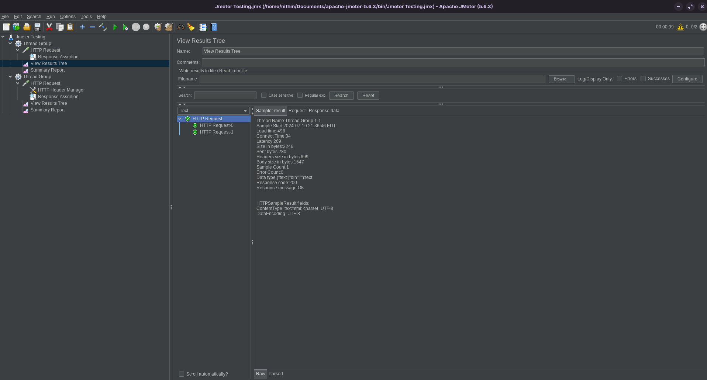
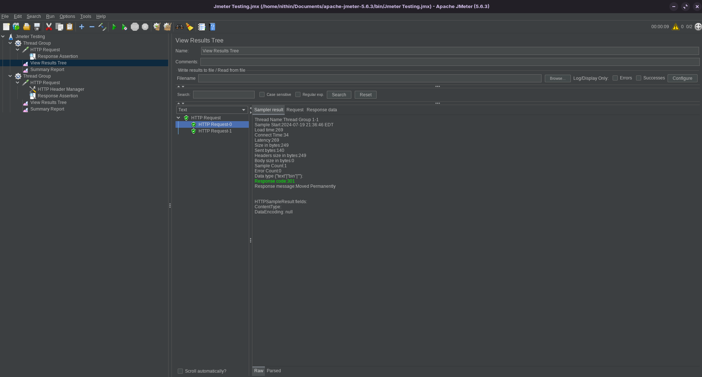
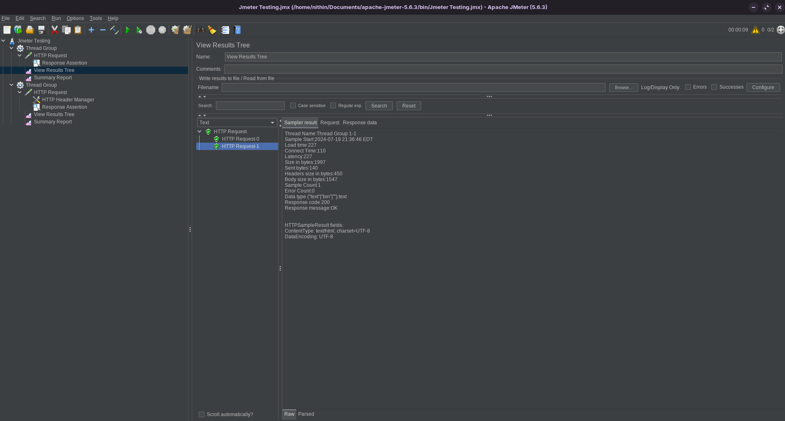
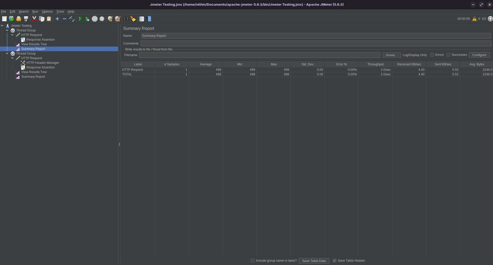

This is a JMeter task. 

    1.Use JMeter to conduct a basic load test on a web application for a HTTP Get request. Setup should include: thread group, sampler, and listeners to view test results.
    2.Update the test to include parametrized post request that takes inputs from JMeter. Ex: username and password to login. 
    3.Add assertions to both tests above 
    4.Add a graph to demonstrate the throughput of both the requests above. 

 
 
 
