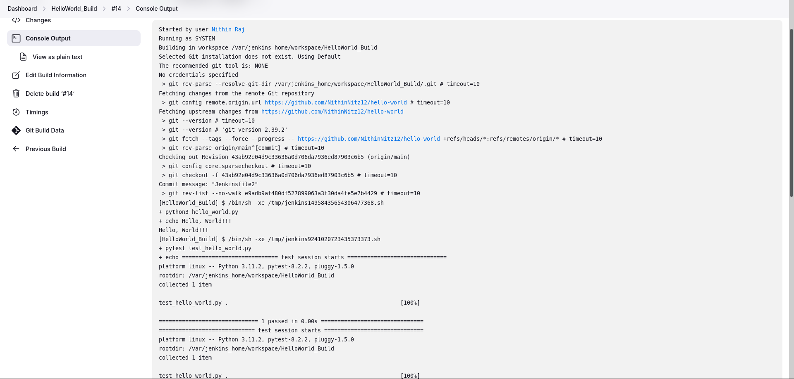
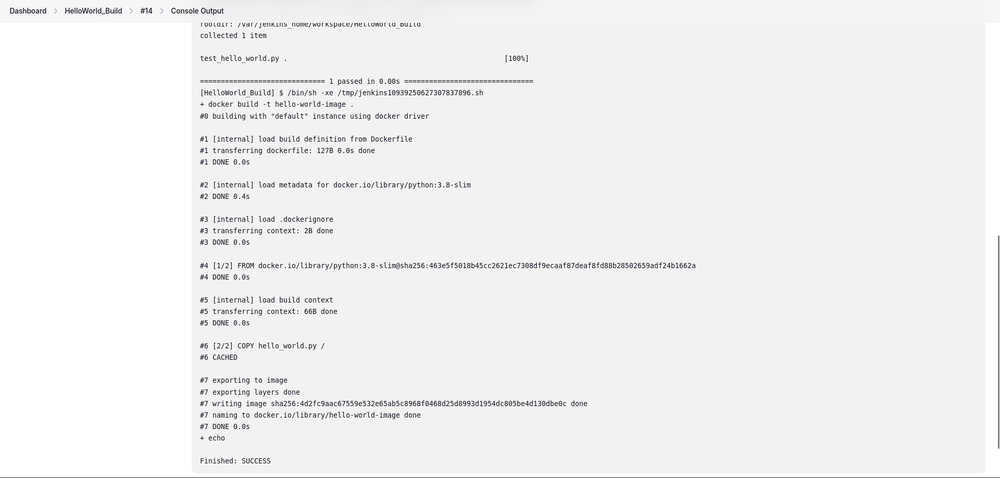
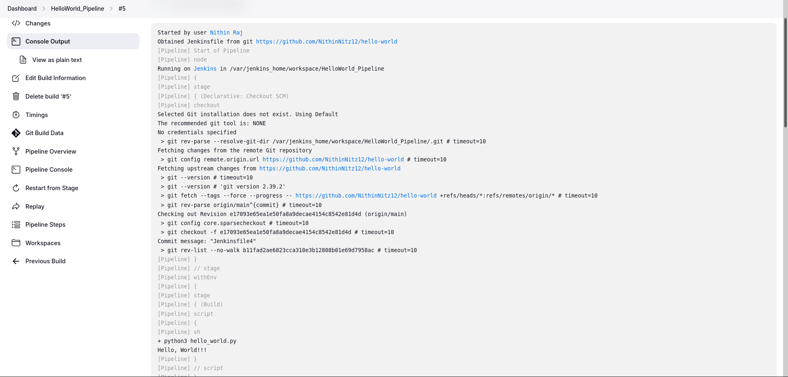
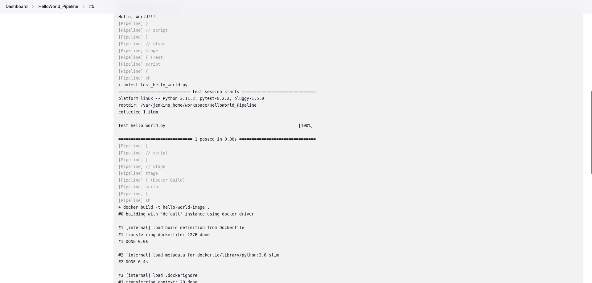
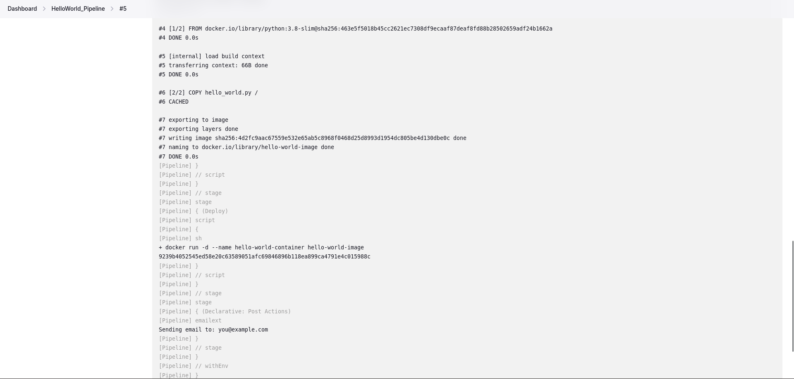
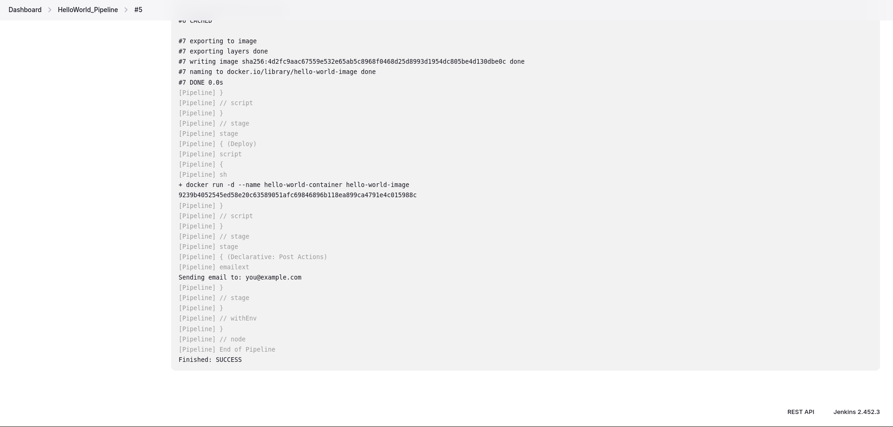
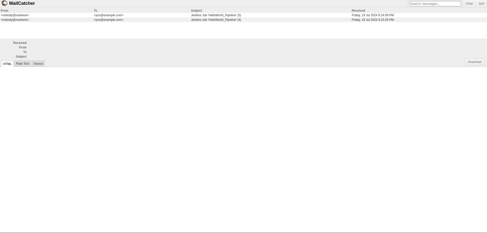
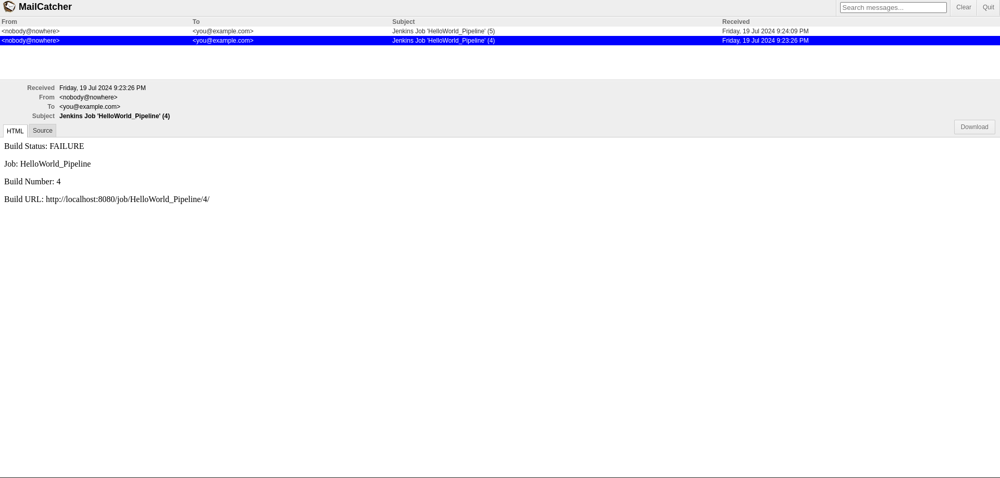
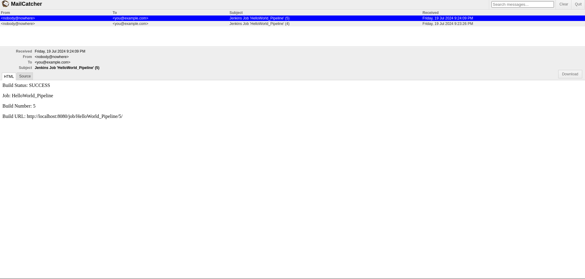

This task requires you to use Jenkins to create multiple jobs. 

    1.Create a Jenkins job to build a simple "Hello World" application from a GitHub repository.
    2.Modify the Jenkins job to build a Docker image of the "Hello World" application.
    3.Extend the Jenkins job to include automated testing of the "Hello World" application.
    4.Rewrite the Jenkins job configuration using a Jenkinsfile. Include stages to build, test and deploy the application in docker. 
    5.Implement email notification when the jobs are run to send the status. Not just for failure scenarios. 
 
 
 
 
 
 
 
 

