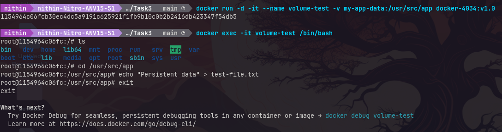

This is a Docker containers task. 

    1.Create a docker image with nodejs installed.
    2.Add a tag to your image docker-4034:v1.0. 
    3.Create a container based on the image and run npm --version to check the npm version is installed correctly. 
    4.Update the docker file to accept volume. 
    5.List the docker volume that was created for the container. 
    6.Exec into the container and create a file in the volume. 
    7.Show the file persists in the volume even after the container is pulled down. Take screenshots to demonstrate the existence of the file.

